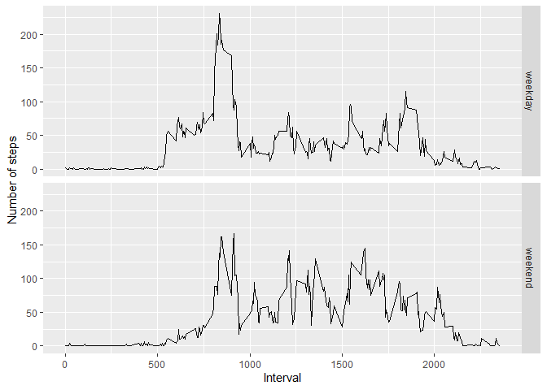

## Loading and preprocessing the data
Read in the data:

```r
data <- read.csv("activity.csv")
summary(data)
```

```
##      steps                date          interval     
##  Min.   :  0.00   2012-10-01:  288   Min.   :   0.0  
##  1st Qu.:  0.00   2012-10-02:  288   1st Qu.: 588.8  
##  Median :  0.00   2012-10-03:  288   Median :1177.5  
##  Mean   : 37.38   2012-10-04:  288   Mean   :1177.5  
##  3rd Qu.: 12.00   2012-10-05:  288   3rd Qu.:1766.2  
##  Max.   :806.00   2012-10-06:  288   Max.   :2355.0  
##  NA's   :2304     (Other)   :15840
```
Packages used for this assignment include 'dplyr','ggplot2',  'knitr' and 'kableExtra'.

```r
library(dplyr)
library(ggplot2)
library(knitr)
library(kableExtra)
```

## What is the mean total number of steps taken per day?
Exclude NA's and take sum of steps, grouped by date:

```r
data_2 <- data[complete.cases(data),]
data_tot <- data_2 %>%
    group_by(date) %>%
    summarise(tot_steps = sum(steps))
```

Histogram of total steps taken:

```r
hist(data_tot$tot_steps, main = "Total number of steps taken", xlab = "steps")
```

<!-- -->
  
Mean number of steps:

```r
mean(data_tot$tot_steps)
```

```
## [1] 10766.19
```
  
Median number of steps:

```r
median(data_tot$tot_steps)
```

```
## [1] 10765
```

## What is the average daily activity pattern?
Take average of steps per interval:

```r
data_mean <- data_2 %>%
    group_by(interval) %>%
    summarise(steps = mean(steps))
```

Time series plot for average number of steps:

```r
with(data_mean, plot(interval, steps, type = "l"))
```

<!-- -->
  
The maximum number of steps:

```r
max_step<- head(data_mean[with(data_mean, order(-steps)),], 3)
kable_classic(kable(max_step, format = "html"), full_width = F, position = "left", font_size = 18, html_font = "Arial")
```

<table class=" lightable-classic" style="font-size: 18px; font-family: Arial; width: auto !important; ">
 <thead>
  <tr>
   <th style="text-align:right;"> interval </th>
   <th style="text-align:right;"> steps </th>
  </tr>
 </thead>
<tbody>
  <tr>
   <td style="text-align:right;"> 835 </td>
   <td style="text-align:right;"> 206.1698 </td>
  </tr>
  <tr>
   <td style="text-align:right;"> 840 </td>
   <td style="text-align:right;"> 195.9245 </td>
  </tr>
  <tr>
   <td style="text-align:right;"> 850 </td>
   <td style="text-align:right;"> 183.3962 </td>
  </tr>
</tbody>
</table>

Interval 835 has the maximum number of steps.

## Imputing missing values
Total number of rows with NA's:

```r
nrow(data[!complete.cases(data),])
```

```
## [1] 2304
```

For this assignment I decided to replace the NA's with the mean of the steps grouped by interval.


```r
data3 <- data
data3 <- data3 %>%
    group_by(interval) %>%
    mutate(steps= ifelse(is.na(steps),
                               mean(steps, na.rm=TRUE), as.numeric(steps)))
```


Take sum of steps, grouped by date:

```r
data_tot2 <- data3 %>%
    group_by(date) %>%
    summarise(tot_steps = sum(steps))
```

Histogram of total steps taken:

```r
hist(data_tot$tot_steps, main = "Total number of steps taken", xlab = "steps")
```

<!-- -->
  
Mean number of steps:

```r
mean(data_tot2$tot_steps)
```

```
## [1] 10766.19
```
  
Median number of steps:

```r
median(data_tot2$tot_steps)
```

```
## [1] 10766.19
```

Replacing the NA's with the mean of the number of steps per interval does not seem to change the mean, and the median is just slightly different.

## Are there differences in activity patterns between weekdays and weekends?

Create a new factor variable in the dataset with two levels -- "weekday" and "weekend" indicating whether a given date is a weekday or weekend day:

```r
data3$date2 <- as.Date(data3$date)
data3 <- data3 %>%
    mutate(weekday = ifelse(weekdays(date2, abbreviate = T ) == "za" | 
                                weekdays(date2, abbreviate = T ) == "zo",
                            "weekend", "weekday"))
```

Panel plot containing a time series plot of the 5-minute interval and the average number of steps taken, averaged across all weekday days or weekend days:

```r
data_mean2 <- data3 %>%
    group_by(interval, weekday) %>%
    summarise(mean_steps = mean(steps))
with(data_mean2, qplot(interval, mean_steps, facets = weekday~., geom = "line",
                       ylab = "Number of steps", xlab = "Interval"))
```

<!-- -->
